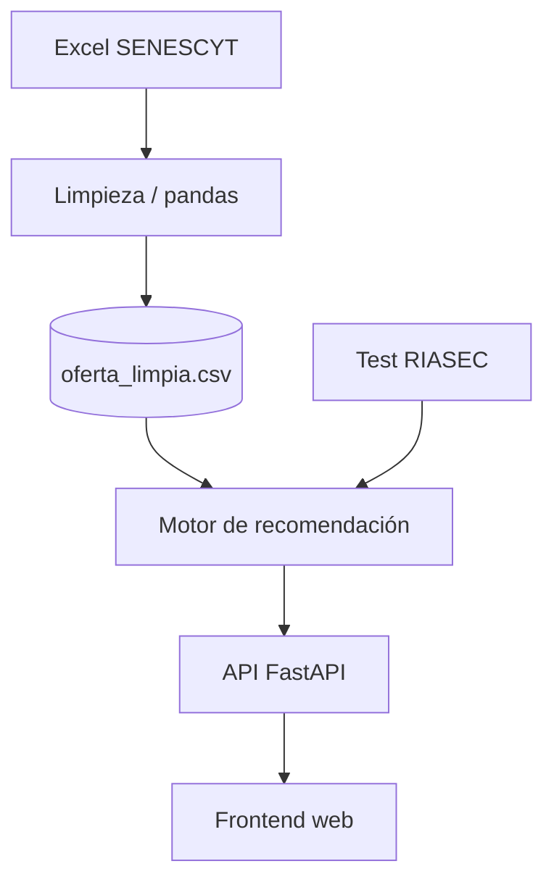

# Recomendador de Carreras Universitarias del Ecuador

Orientación vocacional con Machine Learning sobre datos abiertos de Ecuador

<br>

**Arturo Rodríguez, PhD** · Programación para Inteligencia Artificial

<div class="text-sm opacity-70">ULEAM · Universidad UTE · ISPADE · Universidad del País Vasco</div>

<div class="pt-8 text-sm text-gray-500 dark:text-gray-400">
tucarrera-ecuador.vercel.app
</div>

---

# La oferta de SENESCYT no conecta con los intereses del estudiante

<v-clicks>

- Datos abiertos, pero una **tabla plana** — sin cruce con intereses reales
- RIASEC (Holland) existe hace décadas, casi nunca se conecta con oferta local
- Resultado: miles de bachilleres eligen **sin mapa claro**

</v-clicks>

<!--
Cada año, miles de bachilleres ecuatorianos eligen carrera sin un mapa claro de qué oferta
académica existe y dónde. La oferta de las IES (universidades + institutos) está publicada
por SENESCYT como datos abiertos, pero como una tabla plana -- no hay forma de cruzarla con
los intereses reales del estudiante. La orientación vocacional formal (RIASEC) existe hace
décadas, pero rara vez se conecta con datos reales de oferta académica local.
Transición: "¿y si cruzamos las dos cosas?"
-->

---

# RIASEC + datos reales de SENESCYT = recomendación personalizada

Test de intereses vocacionales, cruzado con la oferta académica real del Ecuador usando
**scikit-learn**.

<!--
Esa es la propuesta central del proyecto: en vez de un test vocacional genérico o una
tabla de oferta sin cruzar, combinar ambas cosas con un motor de recomendación real.
-->

---
layout: image
image: /diagramas/algoritmo-vocacion.jpg
backgroundSize: contain
---

<!--
Mapa completo antes de entrar en cada pieza: el test produce un vector RIASEC; el filtro
duro recorta el pool; cada carrera se vectoriza (85% campo amplio + 15% TF-IDF sobre el
nombre); la similitud coseno mide la afinidad; Haversine aporta la cercanía; y el score
ponderado ordena el ranking. KMeans queda aparte, para explorar por familias.
Los diagramas que siguen abren una a una estas cajas -- este es el índice visual.
-->

---
layout: two-cols
---

# Un pipeline de 4 capas conecta el Excel de SENESCYT con el navegador

<div class="pr-4">

**[1] Datos** — limpieza + mapeo RIASEC
**[2] Motor** — `04_motor_recomendacion.py`
**[3] API** — FastAPI, 6 endpoints
**[4] Frontend** — test → perfil → resultados

</div>

::right::



<!--
[1] Pipeline de datos (offline): Excel SENESCYT -> limpieza -> mapeo RIASEC -> coordenadas.
[2] Motor de recomendación (src/04_motor_recomendacion.py): filtro + TF-IDF +
NearestNeighbors + Haversine + KMeans.
[3] API REST: FastAPI (backend/main.py), 6 endpoints.
[4] Frontend: vanilla JS, test -> perfil -> resultados.
-->

---

# 8014 carreras, 98 cantones, un solo cruce posible hoy

<div grid="~ cols-3 gap-4" class="pt-4">
<div class="p-4 rounded bg-blue-500/10 border border-blue-500/30">

### 8014
carreras vigentes

</div>
<div class="p-4 rounded bg-orange-500/10 border border-orange-500/30">

### 98
cantones con coordenadas

</div>
<div class="p-4 rounded bg-blue-500/10 border border-blue-500/30">

### 10
campos amplios (pesos RIASEC)

</div>
</div>

<!--
Fuente: SENESCYT, Portal Único de Datos Abiertos del Ecuador (5 de febrero de 2025).
Coordenadas de cantones: gist comunitario, con 2 correcciones manuales verificadas
(pendiente migrar a fuente oficial INEC/IGM).
-->

---

# 60 preguntas sí/no producen un vector de 6 dimensiones

Instrumento: **O*NET Interest Profiler** (US Dept. of Labor, licencia abierta)

| | Dimensión | Le gusta... |
|---|---|---|
| **R** | Realista | manos, herramientas, máquinas |
| **I** | Investigativo | observar, analizar, resolver |
| **A** | Artístico | crear, expresarse |
| **S** | Social | ayudar, enseñar, cuidar |
| **E** | Emprendedor | liderar, negociar |
| **C** | Convencional | organizar, procedimientos |

$$\text{puntaje}_d = \frac{\text{respuestas "sí" en los 10 ítems de } d}{10}$$

<!--
60 actividades, 10 por dimensión, presentadas intercaladas para no revelar la categoría de
cada una mientras el estudiante responde. Instrumento: O*NET Interest Profiler Short Form
(National Center for O*NET Development, 2010, US Dept. of Labor), traducido al español.
-->

---
layout: default
class: diagrama
---

<div class="text-xs uppercase tracking-widest opacity-60 mb-3">RIASEC · el hexágono de Holland</div>


<!--
Izquierda: el hexágono de Holland -- dimensiones adyacentes son afines, opuestas son
antagónicas. Derecha: el mismo perfil visto como vector de 6 dimensiones, que es como
lo trata el motor. La tabla de la derecha es ilustrativa (valores de ejemplo).
-->

---

# Filtros booleanos de pandas reducen el pool antes de calcular similitud

`_filtrar_duro()` descarta lo que no cumple una preferencia obligatoria:

- Modalidad · Financiamiento · Tipo de IES · Nivel de formación

<!--
No es machine learning -- es álgebra de conjuntos sobre un DataFrame (modalidad presencial
/ a distancia / en línea / híbrida; financiamiento pública / particular; tipo de IES
universidad / instituto; nivel de formación, por defecto excluye posgrado). Pero reduce el
espacio de búsqueda antes de que el resto de los algoritmos trabajen.
-->

---
layout: default
class: diagrama
---

<div class="text-xs uppercase tracking-widest opacity-60 mb-3">Filtro duro · máscaras booleanas en pandas</div>


<!--
Recorrido: DataFrame completo -> una máscara booleana por criterio -> combinación con &
-> DataFrame refinado. Las filas de ejemplo del diagrama son ilustrativas (no son la
oferta real de SENESCYT).
-->

---

# TF-IDF desempata 338 carreras que antes compartían un mismo vector

<v-clicks>

- Vector RIASEC viene del campo amplio → solo **10 vectores para 8014 carreras**
- Antes: 338 carreras de "Administración..." empataban en **99.5% de afinidad**
- TF-IDF sobre el nombre de la carrera **desempata** dentro del mismo campo
- Mezcla: **85% campo amplio + 15% señal de texto**

</v-clicks>

<!--
_vector_texto_por_carrera(): cada carrera hereda el vector RIASEC de su
CAMPO_AMPLIO_NORMALIZADO (10 categorías). TF-IDF sobre NOMBRE_CARRERA + similitud coseno
contra palabras clave curadas por dimensión (PALABRAS_CLAVE_DIMENSION, teoría de Holland).
Ejemplo real: "MARKETING" saca señal alta en E (Emprendedor); "CONTABILIDAD Y AUDITORIA"
en C (Convencional) -- aunque comparten el mismo campo amplio.
-->

---
layout: default
class: diagrama
---

<div class="text-xs uppercase tracking-widest opacity-60 mb-3">Vector de carrera · 85% campo amplio + 15% TF-IDF</div>


<!--
Izquierda: el nombre de la carrera pasa por TF-IDF -> matriz de términos. Derecha: se
mezcla con el vector RIASEC heredado del campo amplio. Resultado: un vector por carrera,
no uno por campo. Ese 15% es lo que desempata las 338 administraciones.
-->

---

# NearestNeighbors devuelve el ranking completo, no un top-k

`sklearn.neighbors.NearestNeighbors`, métrica coseno, sobre el espacio de 6 dimensiones

$$\text{distancia\_coseno}(u, v) = 1 - \frac{u \cdot v}{\|u\| \, \|v\|}$$

<!--
"¿Qué carreras se parecen a mi perfil?" es un problema de vecinos más cercanos. Se pide
el ranking completo (n_neighbors = todos los candidatos), no un top-k chico, porque el
vector RIASEC viene mayormente del campo amplio (10 categorías) y truncar temprano puede
dejar todo el resultado ocupado por un solo campo. El pool completo ordenado es lo que
necesita el frontend para su slider de "afinidad mínima".
-->

---
layout: default
class: diagrama
---

<div class="text-xs uppercase tracking-widest opacity-60 mb-3">Similitud coseno · ángulo entre perfil y carrera</div>


<!--
El punto: lo que importa es el ÁNGULO, no la magnitud. Ángulo chico -> cos(theta) cerca
de 1 -> perfiles parecidos. Un estudiante que respondió que sí a muchas cosas no queda
favorecido solo por eso. Abajo a la derecha, la misma idea vista como vecinos cercanos.
-->

---

# Haversine mide la distancia real entre cantones

$$a = \sin^2\!\left(\frac{\Delta\phi}{2}\right) + \cos(\phi_1)\cos(\phi_2)\sin^2\!\left(\frac{\Delta\lambda}{2}\right)$$
$$d = 2r \cdot \arcsin(\sqrt{a}) \qquad (r = 6371 \text{ km})$$

Cantón del estudiante vs. cantón de cada oferta → distancia → score 0-1

<!--
Función haversine_km(). La distancia se invierte y escala 0-1 con MinMaxScaler para
convertirla en un score de cercanía, comparable con la similitud RIASEC.
-->

---
layout: default
class: diagrama
---

<div class="text-xs uppercase tracking-widest opacity-60 mb-3">Haversine · distancia sobre la esfera</div>


<!--
Ejemplo con Quito y Guayaquil. La distancia es el arco de gran círculo, no la línea
recta. Abajo: la distancia se invierte y se escala a [0,1] con MinMaxScaler, para que
sea comparable con la similitud RIASEC en el score final.
-->

---

# La cercanía se combina con la afinidad según el peso del estudiante

```
score_final = (1 - peso_cercania) * similitud_riasec + peso_cercania * score_cercania
```

`peso_cercania`: 0 = indiferente · 1 = solo importa vivir cerca

<!--
El estudiante decide cuánto pesa la cercanía geográfica frente a la afinidad RIASEC pura,
con un slider en el frontend (0 a 1).
-->

---
layout: default
class: diagrama
---

<div class="text-xs uppercase tracking-widest opacity-60 mb-3">Score final · combinación, deduplicación y ranking</div>


<!--
Los dos scores entran ponderados al score final; después se deduplica con
drop_duplicates y se ordena. Lo que sale de buscar() es ese ranking completo, sin
recortar. Las filas del diagrama son de ejemplo, no la oferta real.
-->

---

# KMeans agrupa carreras para explorar, no para recomendar

`explorar_clusters_vocacionales()` — separado del flujo de `buscar()`

- Agrupa **todas** las carreras únicas en clústeres vocacionales
- Pensado para "explorá por familia de interés" (futuro, frontend)

<!--
No es una búsqueda puntual -- KMeans opera sobre el mismo espacio de 6 dimensiones
(R,I,A,S,E,C) pero no participa del score_final. buscar() no diversifica ni recorta:
devuelve todo el pool filtrado, ordenado por score_final -- el frontend decide cuánto
mostrar con el slider de afinidad mínima.
-->

---
layout: default
class: diagrama
---

<div class="text-xs uppercase tracking-widest opacity-60 mb-3">KMeans · clústeres vocacionales proyectados con PCA</div>


<!--
El espacio real es de 6 dimensiones; PCA es solo para poder dibujarlo. Los clústeres del
diagrama (social, técnico, artes, ciencias) son ilustrativos del tipo de familias que
salen. Sirve para explorar por familia, no para el ranking puntual.
-->

---

# 6 endpoints envuelven todo el motor en REST

`backend/main.py`

| Método | Endpoint | Qué hace |
|---|---|---|
| GET | `/api/test-riasec` | los 60 ítems del test |
| POST | `/api/calcular-perfil` | respuestas → puntaje RIASEC |
| GET | `/api/opciones` | valores para los filtros |
| POST | `/api/recomendar` | perfil + preferencias → carreras ordenadas |
| POST | `/api/comentario-perfil` | comentario opcional por IA (Groq) |

<!--
También existe GET /api/salud (healthcheck), omitido de la tabla por espacio.
/api/recomendar devuelve TODAS las carreras que pasan el filtro duro, sin tope, ordenadas
por score_final -- el frontend decide cuánto mostrar. /api/comentario-perfil requiere
GROQ_API_KEY server-side (nunca en el frontend) y falla en silencio si no está configurada.
-->

---
layout: image-right
image: /screenshot_resultados.png
---

# 3 pantallas llevan al estudiante del test al resultado

Vanilla JS — sin framework

- Test RIASEC (60 ítems)
- Perfil + preferencias
- Resultados: lista + "Mapa de afinidad"

<!--
El "Mapa de afinidad" es un diagrama de círculos concéntricos por tier (núcleo / intermedio
/ alejada), calculado en el cliente sobre similitud_riasec, con un slider de afinidad
mínima. Los filtros de búsqueda (modalidad, financiamiento, cercanía) viven en un panel
colapsable dentro de resultados, no en la pantalla de perfil.
-->

---

# El motor completo corre en vivo en un notebook Colab

**`notebooks/demo_backend_colab.ipynb`** — sin subir archivos, datos de muestra embebidos

- Cada algoritmo en su propia celda-demo
- Perfil RIASEC editable → recomendaciones cambian al vuelo

<div class="pt-8 text-center text-xl">
👉 vamos al notebook
</div>

<!--
Filtro duro, TF-IDF, NearestNeighbors, Haversine y KMeans: cada uno aislado y explicado
antes de integrarse al motor completo. Cambiás los 6 valores RIASEC y volvés a correr
para ver cómo cambian las recomendaciones.
-->

---

# El sistema corre en producción sobre las 8014 carreras reales

<div class="text-2xl text-center pt-4 pb-8">

🔗 **tucarrera-ecuador.vercel.app**

</div>

| Capa | Dónde |
|---|---|
| Frontend | Vercel |
| Backend | Render — FastAPI |
| Motor | el mismo código de este deck |

<!--
No es solo un ejercicio académico -- está en producción de punta a punta. Backend expuesto
en tucarreraecuador.onrender.com (ver frontend/config.js).
-->

---

# 4 pendientes antes de llevar esto más allá del aula

<v-clicks>

1. Aprendizaje supervisado (`RandomForestClassifier`) sobre feedback real
2. Ampliar `PALABRAS_CLAVE_DIMENSION` con más vocabulario
3. Validar el mapeo RIASEC↔campo amplio con un orientador vocacional
4. Migrar coordenadas de cantones a la fuente oficial INEC/IGM

</v-clicks>

<!--
1. RandomForestClassifier reentrenando el re-ranking con feedback real de usuarios
   ("me interesó" / "no me interesó").
2. PALABRAS_CLAVE_DIMENSION hoy son listas cortas curadas a mano.
3. El mapeo RIASEC↔campo amplio también está curado a mano, sin revisión de un experto.
4. Coordenadas de cantones vienen hoy de un gist comunitario, con 2 correcciones manuales.
-->

---

# Fuentes y créditos

- Oferta académica: **SENESCYT**, Portal Único de Datos Abiertos del Ecuador (5-feb-2025)
- Test vocacional: **O*NET Interest Profiler** (2010), U.S. Department of Labor

<!--
National Center for O*NET Development (2010), O*NET Interest Profiler Short Form,
U.S. Department of Labor -- licencia abierta, traducido al español para este proyecto.
-->

---
class: text-center
---

# Gracias

**Arturo Rodríguez, PhD** ([ORCID 0000-0002-7017-9443](https://orcid.org/0000-0002-7017-9443))

<div class="text-sm opacity-70">ULEAM · Universidad UTE · ISPADE · Universidad del País Vasco</div>

tucarrera-ecuador.vercel.app
